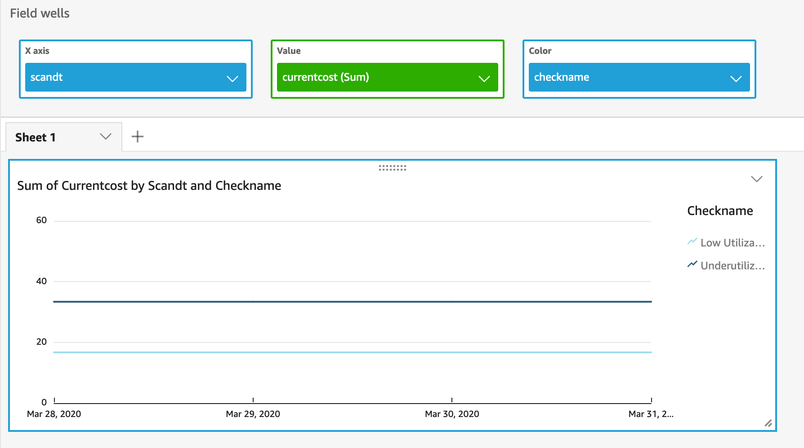

# AWS Cost optimization  - Trusted advisor Aggregator using serverless technologies 

## About this application 

Trusted advisor is one of the tool used widely to find out underutilised resources. There are multiple check which needs to be refreshed on regular basis. Once the checks are refreshed, 
one can see the report with list of underutilised resources. 

However, with this , the historical information is lost. This project will help you get started with aggregating such data on daily basis. This will ensure you track your efforts for 
cost optimization and visualise the trend in quick sight. The Trusted Advisor API calls are available to customers with [Business or Enterprise support plan](https://docs.aws.amazon.com/awssupport/latest/user/Welcome.html) only.
  

There are 5 very popular checks configured
*  Low Utilization Amazon EC2 Instances
*  Idle Load Balancers
*  Underutilized Amazon EBS Volumes
*  Amazon RDS Idle DB Instances
*  Underutilized Amazon Redshift Clusters


These checks are run on daily basis and refresh is triggered for the above rule

Architecture Diagram


Key components
* AWS Lambda function
* Glue Database
* Glue Crawler
* QuickSight


## Deploy the sample application

The Serverless Application Model Command Line Interface (SAM CLI) is an extension of the AWS CLI that adds functionality for building and testing Lambda applications. It uses Docker to run your functions in an Amazon Linux environment that matches Lambda. It can also emulate your application's build environment and API.

To use the SAM CLI, you need the following tools.

* SAM CLI - [Install the SAM CLI](https://docs.aws.amazon.com/serverless-application-model/latest/developerguide/serverless-sam-cli-install.html)
* Java11 - [Install the Java 11](https://docs.aws.amazon.com/corretto/latest/corretto-11-ug/downloads-list.html)
* Maven - [Install Maven](https://maven.apache.org/install.html)
* Docker - [Install Docker community edition](https://hub.docker.com/search/?type=edition&offering=community)

To build and deploy your application for the first time, run the following in your shell:

```bash
sam build
sam deploy --guided
```

The first command will build the source of your application. The second command will package and deploy your application to AWS, with a series of prompts:

* **Stack Name**: The name of the stack to deploy to CloudFormation. This should be unique to your account and region, and a good starting point would be something matching your project name.
* **AWS Region**: The AWS region you want to deploy your app to.
* **Confirm changes before deploy**: If set to yes, any change sets will be shown to you before execution for manual review. If set to no, the AWS SAM CLI will automatically deploy application changes.
* **Allow SAM CLI IAM role creation**: Many AWS SAM templates, including this example, create AWS IAM roles required for the AWS Lambda function(s) included to access AWS services. By default, these are scoped down to minimum required permissions. To deploy an AWS CloudFormation stack which creates or modified IAM roles, the `CAPABILITY_IAM` value for `capabilities` must be provided. If permission isn't provided through this prompt, to deploy this example you must explicitly pass `--capabilities CAPABILITY_IAM` to the `sam deploy` command.
* **Save arguments to samconfig.toml**: If set to yes, your choices will be saved to a configuration file inside the project, so that in the future you can just re-run `sam deploy` without parameters to deploy changes to your application.

You can find your lambda ARN in the output values displayed after deployment.
SAM template uploads the code in the S3 bucket which is referenced in samconfig.toml with key as s3_bucket. This bucket will be automatically created or can be pre-provisioned if there is a need to do so


The SAM CLI installs dependencies defined in `CostDatalake/pom.xml`, creates a deployment package, and saves it in the `.aws-sam/build` folder.

### Manual Trigger
The Lambda function and Glue crawler is scheduled to run once a day. If you do not want to wait for the duration (during initial deployment), you can also trigger the [lambda function](https://aws.amazon.com/blogs/compute/improved-testing-on-the-aws-lambda-console/) and glue crawler manually via AWS Console.


## Build visualization in QuickSight

Allow the code to gather data for couple of days until you start visualization.

* Goto Quicksight Console
* Click on Manage data
* Create an New Data set by clicking New data set button
* Select data source as Athena
* Enter a name for the datasource and click create data source
* Select database which starts with name costdatatlake_tabucket_*
* Select the table in the database and click next
* Select directly query your data option and click on visualise

Once the Visualiation screens is selected , we need to convert the scandate field (unix date) to date field.
To do that
* Click on + button and select Add calculated field
* Enter name as scandt and put following string in formula field and click create

```
epochDate(scandate)
```

Now you can create multiple visuals based on data collected. One such visual is to to trend analysis with a 
line chart. To do that
* Select line chart from the visual types
* Drag scandt field on x axis
* Drag currentcost on the  value 
* Drag check name on the color

This will create a visual as mentioned below




## Query underutilised resources using Athena

We can also query the data collected using athena. This will be needed if there is need to get the resource id , account and region for the resource. To do that visit Athena query editor
To start with, run following query

```
SELECT * FROM "costdatabase-<<dbidentifier>>"."costdatalake_tabucket_<<tableidentifier>>" limit 100
```
Replace the <<dbidentifier>> and <<tableidentifier>> as per the resource created by SAM template

You can add date month and year in the where field to avoid full scan. This will ensure only the scan a partition

```
SELECT * FROM "costdatabase-<<dbidentifier>>"."costdatalake_tabucket_<<tableidentifier>>" where year='2020' and month='3' and date = '31' and checkname = 'Low Utilization Amazon EC2 Instances'
```

The above query will return Low Utilization Amazon EC2 Instances for date 31st March 2020


## Cleanup

To delete the sample application that you created, use the AWS CLI. Assuming you used your project name for the stack name, you can run the following:

```bash
aws cloudformation delete-stack --stack-name aws-cost-datalake
```

Ensure we delete the dataset and visualization  in the quicksight

## Resources

See the [AWS SAM developer guide](https://docs.aws.amazon.com/serverless-application-model/latest/developerguide/what-is-sam.html) for an introduction to SAM specification, the SAM CLI, and serverless application concepts.

Next, you can use AWS Serverless Application Repository to deploy ready to use Apps that go beyond hello world samples and learn how authors developed their applications: [AWS Serverless Application Repository main page](https://aws.amazon.com/serverless/serverlessrepo/)
